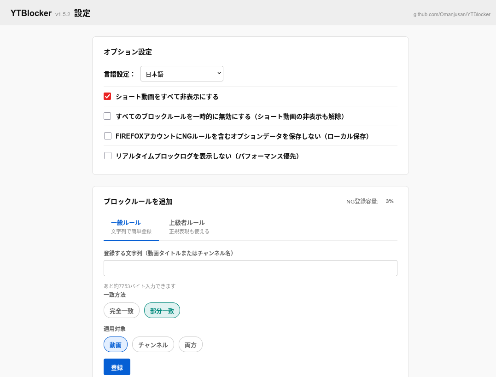
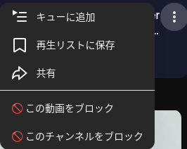

# YTBlocker

[English version here](README.md)

## 目的

Firefoxの拡張機能です。ユーザーが設定したルールによりYoutubeのおすすめ動画カードの表示をブロックできます。既存のアドオンでは日本語込の動画ブロックがうまく機能しないことがあったのでそれを補完しました

## 機能

- Youtubeのみが対象.無限スクロールによる好みでない動画カードを設定した動画名もしくはチャンネル名の一致で非表示化

- 設定によりショート動画を非表示にできます

## 特徴

- 2通りの非表示への導線
動画脇にある︙メニュー内から直接動画名もしくはチャンネル名でブロックもしくは文字列指定の2通り

- 設定画面からはNG動画用のブロックルールを文字列指定できます。文字列指定は次の2種のタブから行えます
一般タブ : 完全一致と部分一致のどちらかを選べます。簡単なルール
上級者タブ : 上記2種の一致方法に加えて正規表現が使えます

- チャンネル内や動画再生中のおすすめ動画欄も︙のメニュー対象

- Firefoxのアカウントストレージを使うので別の環境への設定引き継ぎ可能。各端末がルール一覧と削除記録をアカウントストレージに置き、他端末はそれを取り込んで追加・削除の両方を反映します。ローカル保存オプションが有効な場合はアカウントストレージのやりとりを無視します。

- ver1.5.2からdom操作による非表示から見た目上の非表示に変更
広告ブロッカーなどと喧嘩しなくなりました。ショート動画を非表示にしたときのレイアウト残骸は広告ブロッカーの要素ブロック機能を使ってください。

## インストール

Firefoxの拡張機能YTBlockerで検索してインストールしてください（[配布ページ](https://addons.mozilla.org/ja/firefox/addon/youtublocker/)）

## 使い方

インストールが終わったらYoutubeにアクセスし、下記の2通りの方法のどちらかでブロックルールを決めていくだけです。

### ブロック方法 1 : 設定画面からNG文字列を設定

設定画面からNG指定にする文字列を登録できます。
動画名または動画チャンネル名に対して評価をするかのどちらか、両方による評価のブロックも可能です。
上級者タブからは正規表現がつかえるのでより汎用的なブロックもできます。

### ブロック方法 2 : 動画横にある︙からブロック指定

動画横にある︙メニューからブロックできます。こちらは文字列より簡単にブロック可能です。

## 動作上の注意

ブロック対象のチャンネルに移動したときそのチャンネルが所有する動画ブロックは行いません。したがってブロック済みのものが一時的に表示されるようになりますがバグではありません。チャンネルカードとチャンネルページ配下のコンテンツまではブロックしないと理解ください。ただしショート動画はこの限りではありません。さらにブロック対象チャンネルの中にある他チャンネルのブロック対象動画は非表示で動作します。

## ライセンス

本ソフトウェアは[MITライセンス](LICENSE)の下で提供されています。