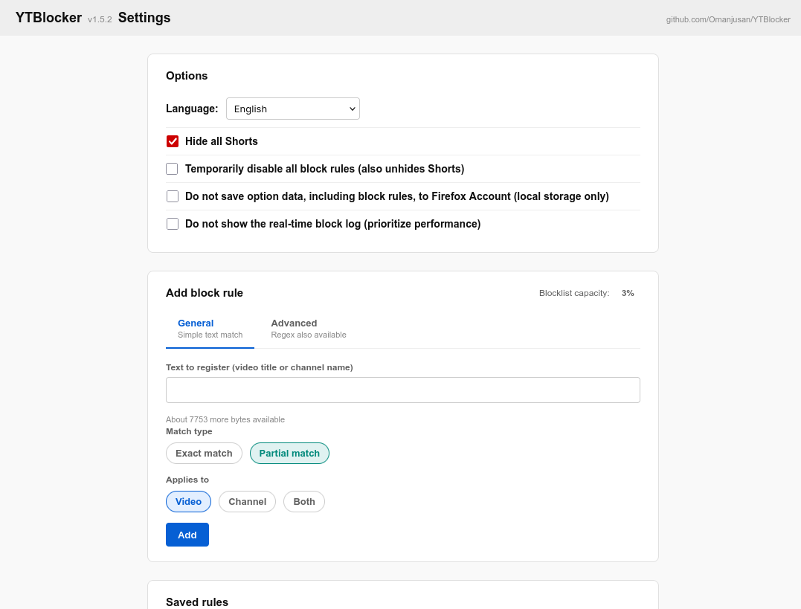
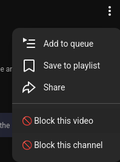

# Youtube Keyword Blocker

[日本語版はこちら](README.ja.md)

## Purpose

A Firefox extension. It lets users block recommended video cards on YouTube based on rules they set. Some existing add-ons don't handle blocking of video titles containing Japanese text well, so this extension was made to complement that.

## Features

- Works on YouTube only. Hides video cards that don't match your preference (as they appear via infinite scroll) by matching the video title or channel name

- You can hide Shorts via a setting

## Highlights

- Two ways to hide videos
Block directly by video title or channel name from the ︙ menu next to a video, or by specifying a string in settings

- From the settings screen you can register blocking rules for NG videos by specifying strings, using either of two tabs:
General tab: choose between exact match and partial match. Simple rules
Advanced tab: in addition to the two match methods above, regular expressions are available

- The ︙ menu also works on recommended video lists shown inside a channel page or during video playback

- Uses Firefox's account storage, so settings can carry over to another environment. Each device stores its rule list and deletion records in account storage, and other devices pick them up and reflect both additions and deletions. When the local-only storage option is enabled, account storage traffic is ignored.

- Since ver 1.5.2, hiding has changed from DOM removal to visual hiding
This means no more conflicts with ad blockers. For layout leftovers when hiding Shorts, use your ad blocker's element-blocking feature.

## Installation

Search for "Youtube Keyword Blocker" in Firefox add-ons and install it ([add-on page](https://addons.mozilla.org/ja/firefox/addon/youtublocker/)).

## Usage

Once installed, go to YouTube and just set up blocking rules using either of the two methods below.

### Blocking method 1: Set NG strings from the settings screen

You can register strings to treat as NG (blocked) from the settings screen.
You can evaluate against the video title, the channel name, or both.
Regular expressions are available in the Advanced tab, so you can create even more general-purpose blocking rules.

### Blocking method 2: Block via the ︙ menu next to a video

You can block directly from the ︙ menu next to a video. This is simpler than using strings.

## Notes on behavior

When you navigate to a blocked channel, videos owned by that channel are not blocked. Blocked items will therefore appear temporarily — this is not a bug. Please understand that the channel card and the content under the channel page are not blocked. Shorts, however, are an exception to this. Furthermore, blocked videos owned by other channels that appear within that blocked channel's page are still hidden.

## License

This software is provided under the [MIT License](LICENSE).
